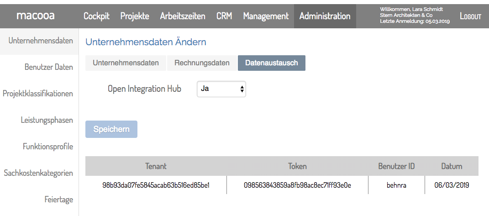

# macooa-adapter

[macooa](https://macooa.com) has been designed as a full service suite for Small and Medium Sized Enterprises in order to steer business processes online. [macooa](https://macooa.com) comprises projectplans, projectcontrolling, worktimes, holidayplans, cockpit, cost benefit analysis, project organisation, CRM, client / contact data, sales-pipeline and many more. 

This **adapter** connects client and contact data being held in the CRM of [macooa](https://macooa.com) with third-party applications. With this **adapter** you are able to create different application flows. It supports **"Triggers"** (e.g. ``getPersons``, ``getOrganisations``) as well as **"Actions"** (e.g. ``insertPerson``, ``updateOrganisation``, ``deletePerson``, etc.), therefore with this **adapter** you could both read and fetch data from [macooa](https://macooa.com) and write and save data in [macooa](https://macooa.com).

## Before you begin

Before you can use the component you **must be a registered macooa user**. Please visit the home page of [macooa](https://macooa.com) to sign up.
> Any attempt to reach [macooa](https://macooa.com) endpoints without registration will not be successful.

After you registered in [macooa](https://macooa.com) you have to retrieve your **Token** and your **Tenant** from [macooa](https://macooa.com).
> For activation you **have to be logged in**, then click onto ``Administration`` and under the menue item ```Unternehmensdaten``` click onto the tab ``Datenaustausch``. Once you are in ``Datenaustausch`` select ``Ja`` and save the settings. After that a table will be shown on the screen which outlines both, **Token** and **Tenant**.



Once the activation is done you have access to **API Keys** which are required for an authentication when you make a request to [macooa](https://macooa.com).

## Actions and triggers
The **adapter** supports the following **actions** and **triggers**:

#### Triggers:

  - Get person - (```getPerson.php```)
  - Get persons - (```getPersons.php```)
  - Get organisation - (```getOrganisation.php```)
  - Get organisations - (```getOrganisations.php```)

#### Actions:

  - Insert person (```insertPerson.php```)
  - Insert organisation(```insertOrganisation.php```)
  - Update person (```updatePerson.php```)
  - Update organisation (```updateOrganisation.php```)
  - Delete person (```deletePerson.php```)
  - Delete organisation (```deleteOrganisation.php```)

**NOTE:** As mentioned before, to perform an action or a call trigger you have to be a registered [macooa](https://macooa.com) user and you have to pass your **API Key** (in [macooa](https://macooa.com) named **Token** and **Tenant**) when you send a request.

##### Get persons

Get person trigger (```getPersons.php```) performs a request which fetch all persons belonging to the given macooa tenant from [macooa](https://macooa.com).

##### Get organisations

Get organisation trigger (```getOrganisations.php```) performs a request which fetch all organisations belonging to the given macooa tenant from [macooa](https://macooa.com).

##### Insert person

Insert person action (``insertPerson.php``) inserts a new person into the given macooa tenant [macooa](https://macooa.com).

##### Insert organisation

Insert organisation action (``insertOrganisation.php``) inserts a new organisation into the given macooa tenant [macooa](https://macooa.com).

##### Update person

Update person action (``updatePerson.php``) updates an existing person using the given macooa tenant in [macooa](https://macooa.com).

##### Update organisation

Update organisation action (``updateOrganisation.php``) updates an existing organisation using the given macooa tenant in [macooa](https://macooa.com).

##### Delete person

Delete person action (``deletePerson.php``) deletes an existing person using the given macooa tenant in [macooa](https://macooa.com).

##### Delete organisation

Delete organisation action (``deleteOrganisation.php``) deletes an existing organisation using the given macooa tenant in [macooa](https://macooa.com).

***

## License

Apache-2.0 © [macooa GmbH](https://macooa.com/)
